# FINAL PROJECT REPORT: SIMPLE LMS

## 1. Identitas
- **Nama:** Puriarto Bagas Widiantoro
- **NIM:** A11.2023.14962
- **Mata Kuliah:** Pemrograman Sisi Server 
- **URL Repository:** https://github.com/widipuriarto/simple-lms

## 2. Deskripsi Project
Simple LMS adalah sebuah sistem manajemen pembelajaran berbasis *backend* yang mengusung arsitektur *microservices-ready*. Dibangun dengan kerangka kerja Django Ninja modern, proyek ini menyediakan fungsionalitas mumpuni; mulai dari hierarki materi (*Section & Lesson*) yang terstruktur, perekaman jejak progres (*Progress*) siswa yang akurat secara matematis, hingga fitur komunitas seperti sistem Ulasan (*Review*) dan Daftar Keinginan (*Wishlist*).

Keseluruhan proyek telah dikontainerisasi secara penuh menggunakan ekosistem Docker yang menghubungkan *web server* Django dengan relasi database PostgreSQL, basis data NoSQL MongoDB untuk *log* aktivitas, mesin antrean tugas RabbitMQ, dan lapisan *caching* kueri Redis.

## 3. Fitur Dasar yang Sudah Berjalan
Berikut adalah fondasi fitur dasar penyokong sistem yang sukses beroperasi:
1. **Dockerized Environment:** Sistem berjalan sempurna dan terorkestrasi di atas Docker Compose.
2. **PostgreSQL Database:** Sistem penyimpanan relasional yang sukses ter-migrasi.
3. **Authentication JWT:** Mengamankan akses *endpoint* via token *Bearer*.
4. **Role-Based Access Control (RBAC):** Proteksi wewenang Admin, Instructor, dan Student terintegrasi dengan kokoh.
5. **Course API:** Menyediakan opsi pencarian hingga pengelolaan konten materi (CRUD).
6. **Enrollment & Progress:** Siswa diwajibkan mendaftar sebelum membaca kursus, dan penyelesaian materinya terekam.
7. **Swagger/OpenAPI:** Seluruh interaksi *endpoint* terdokumentasi otomatis.

## 4. Fitur Tambahan yang Dipilih (Paket 1 - LMS Experience)
| No | Fitur Tambahan | Kategori | Poin | Status |
| :-: | :--- | :--- | :-: | :--- |
| 1 | Search, filter, dan sorting course lanjutan | Paket 1 | 12 | Selesai |
| 2 | Rating, review, dan wishlist course | Paket 1 | 12 | Selesai |
| 3 | Curriculum dan progress belajar detail | Paket 1 | 15 | Selesai |
| 4 | Student dashboard | Paket 1 | 12 | Selesai |
| **Total**| | | **51** | **100% Selesai** |

## 5. Penjelasan Implementasi & Bukti Pengujian (Screenshots)

*Seluruh dokumentasi gambar (*assets*) diambil secara langsung dari hasil pengujian *live* sistem dan antarmuka Swagger API.*

### A. Komponen Wajib (Fondasi Project)

#### 1. Project dapat dijalankan dengan Docker Compose
**Deskripsi Implementasi:**
Keseluruhan sistem *Simple LMS* ini dibungkus (*containerized*) menggunakan Docker. Komponen-komponen seperti *web server* (Django), *database* (PostgreSQL & MongoDB), *message broker* (RabbitMQ), dan *cache* (Redis) diorkestrasi secara terpusat melalui konfigurasi file `docker-compose.yml`.

**Bukti Pengujian:**
- 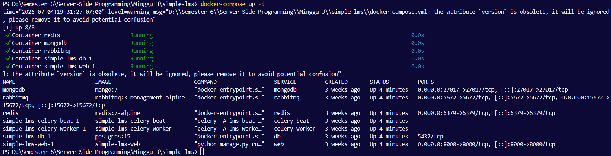
*Gambar di atas adalah output dari perintah `docker-compose ps` yang menunjukkan seluruh container beroperasi mulus (berada pada state Up).*

#### 2. Database PostgreSQL berjalan dan migration berhasil
**Deskripsi Implementasi:**
Sebagai media penyimpanan relasional utama, aplikasi ini dihubungkan secara eksklusif ke instance PostgreSQL. Skema tabel dikonstruksi secara otomatis melalui sistem *Migration* bawaan Django yang dioperasikan sesaat setelah kontainer database siap.

**Bukti Pengujian:**
- 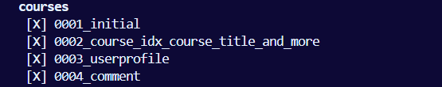
*Tangkapan layar di atas memperlihatkan deretan checklist `[X]` pada aplikasi `courses` dan aplikasi inti lainnya, membuktikan bahwa skema database berhasil diterapkan sepenuhnya ke dalam PostgreSQL.*

#### 3. Model Utama LMS (User, Category, Course, Lesson, Enrollment, Progress)
**Deskripsi Implementasi:**
Sebagai fondasi dari sistem *Learning Management System*, kami telah mendefinisikan seluruh model data esensial yang saling berelasi. Model-model tersebut mencakup: entitas `User` (dikembangkan dengan profil Role), `Category` (kategori kursus), `Course` (entitas kursus inti), `Lesson` (sub-materi kursus), `Enrollment` (pendaftaran siswa), dan `Progress` (jejak penyelesaian materi).

**Bukti Pengujian:**
- 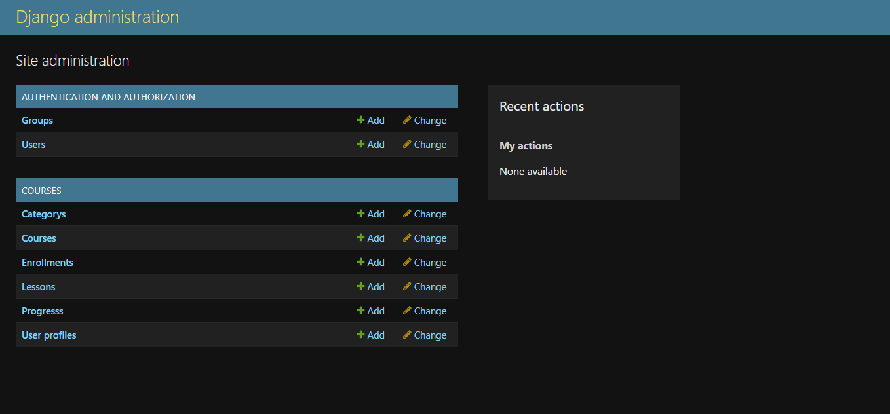
*Halaman beranda Django Admin yang menampilkan daftar seluruh tabel model LMS yang telah diregistrasikan dan siap dikelola (CRUD).*

#### 4. Authentication JWT Berjalan & Role admin, instructor, student diterapkan
**Deskripsi Implementasi:**
Aplikasi mengamankan *endpoints* dengan menggunakan *JSON Web Token* (JWT) via pustaka `ninja_simple_jwt`. Untuk manajemen hak akses atau *Role-Based Access Control* (RBAC), pengguna dibagi menjadi tiga tingkatan *role*:
- **Admin**: Role absolut (termasuk penghapusan *Course*).
- **Instructor**: Role yang diizinkan untuk merancang dan mempublikasikan *Course* beserta *Lesson*.
- **Student**: Role terbatas hanya pada akses konsumsi (*enroll* dan *view* materi).

**Bukti Pengujian:**
- 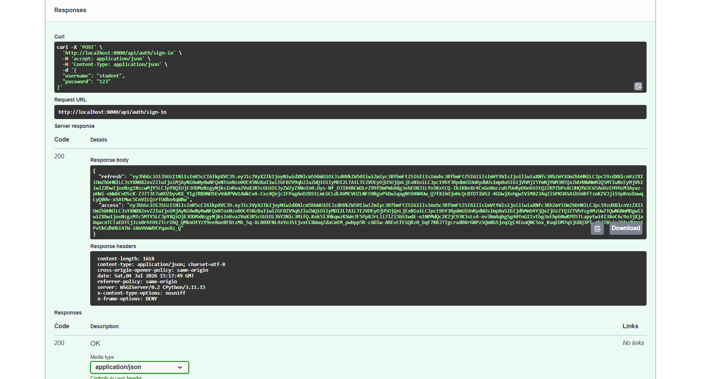
*Hasil login akun tipe student yang memunculkan token Bearer (Access & Refresh token).*
- 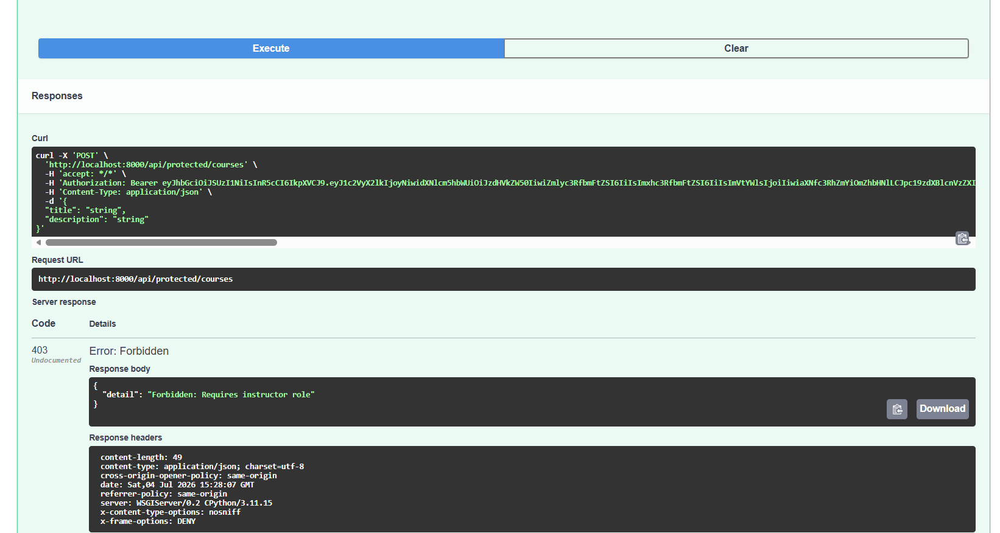
*Hasil penolakan hak akses (Role Forbidden / HTTP 403) ketika akun tipe student mencoba memaksa membuat sebuah course.*
- 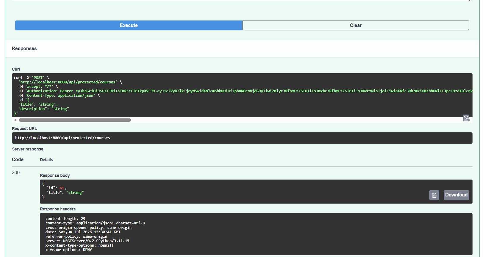
*Hasil kesuksesan (Role Success) ketika akun tipe instructor sukses membuat sebuah course.*
- 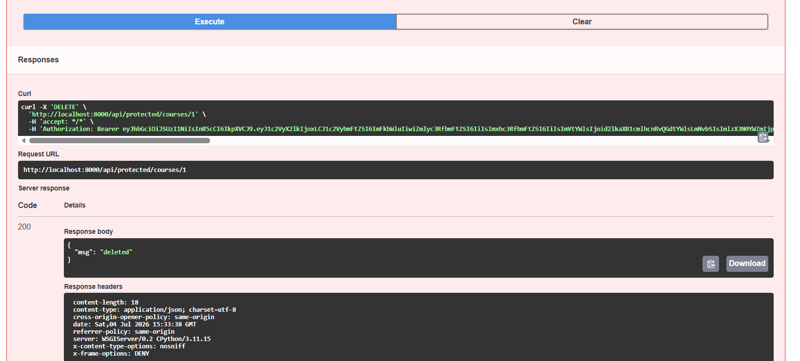
*Hasil pengujian role admin yang sukses menghapus course.*

#### 5. Endpoint course, lesson, enrollment, progress berjalan
**Deskripsi Implementasi:**
Sistem menyediakan antarmuka REST API komprehensif. *Course API* melayani pencarian dan CRUD. *Enrollment API* mencatat pendaftaran siswa agar mereka berhak mengakses materi. Sementara *Progress API* mencatat jejak penyelesaian tiap materi (*lesson*).

**Bukti Pengujian:**
- 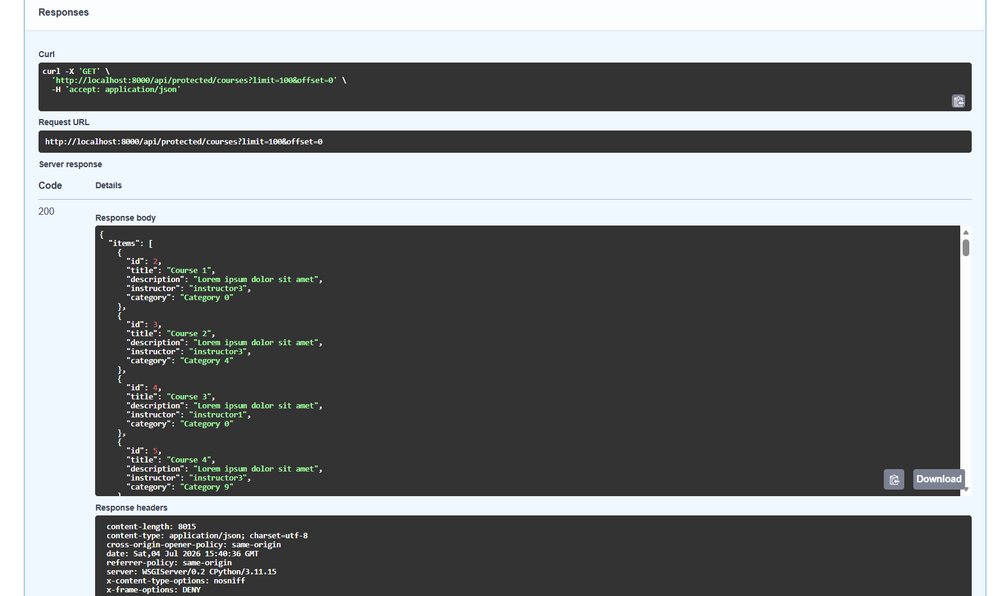
*Hasil eksekusi `GET /api/v1/protected/courses` yang menampilkan keseluruhan daftar kursus secara publik.*
- 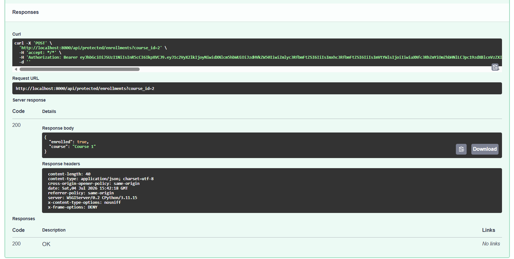
*Hasil eksekusi `POST /api/v1/protected/enrollments` saat Student berhasil mendaftarkan diri pada sebuah kursus.*

#### 6. Swagger/OpenAPI dapat diakses
**Deskripsi Implementasi:**
Dokumentasi API interaktif dirender otomatis melalui fitur *OpenAPI Schema* bawaan `django-ninja`. Kehadiran Swagger UI menjadi sarana vital untuk mempermudah eksplorasi *endpoints*, struktur JSON, dan melakukan pengujian *real-time*.

**Bukti Pengujian:**
- 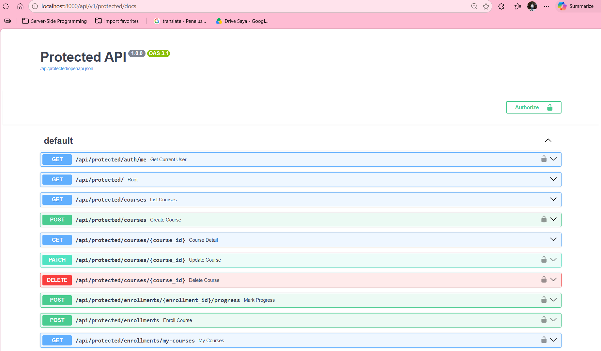
*Halaman utama Swagger UI yang memuat daftar lengkap berbagai endpoint API yang terekspos dari backend LMS.*

---

### B. Fitur Tambahan: Paket 1 – LMS Experience

#### 1. Database & Model Enhancement (Prasyarat)
**Deskripsi Implementasi:**
Sebagai fondasi paket ekstensi, skema `Course` ditambahkan variabel enumerasi `level` dan `status`. Tiga buah entitas pendukung yang benar-benar baru (`Section`, `Review`, dan `Wishlist`) divalidasi dan dilempar (*migrate*) ke database.

**Bukti Pengujian:**
- 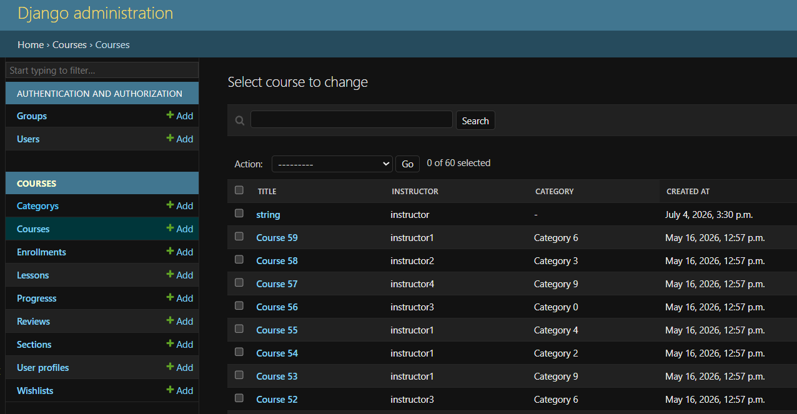
*Penampakan mutakhir portal admin yang telah merangkum model tabel-tabel ekstensi baru (Reviews, Sections, Wishlists).*

#### 2. Search, filter, dan sorting course lanjutan
**Deskripsi Implementasi:**
*Course mudah ditemukan berdasarkan keyword, category, instructor, level, status, dan sorting.* Kami mengimplementasikan logika penyaringan menggunakan antarmuka `django-ninja` (Schema Filter) dikombinasikan dengan pencarian teks penuh (mencari ke dalam judul dan deskripsi) via objek klausa `Q` pada ORM Django di rute `GET /courses`.

**Bukti Pengujian:**
- 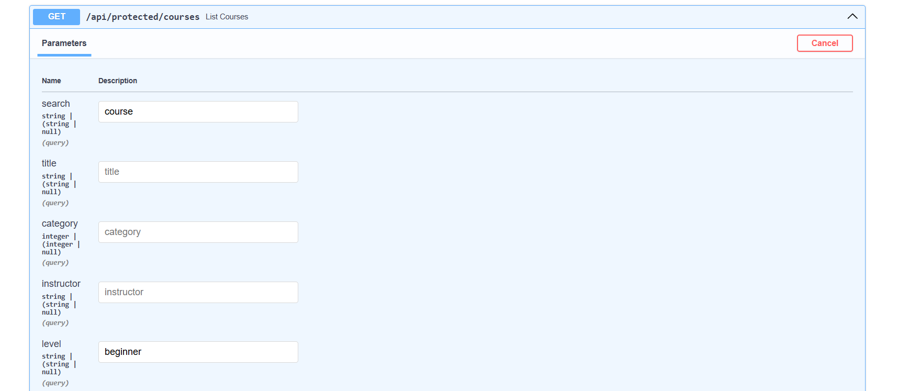
*Tampilan form filter pada antarmuka interaktif Swagger.*
- 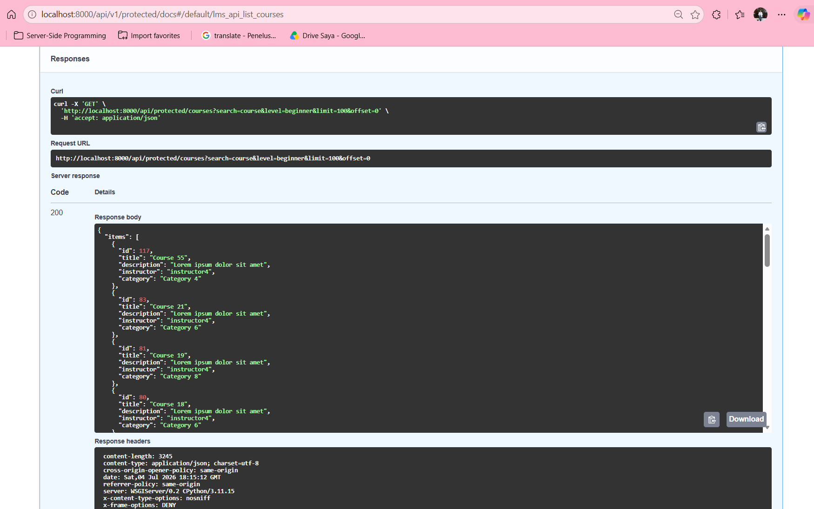
*Hasil pengujian eksekusi endpoint `GET /courses` dengan memberikan kombinasi nilai input spesifik di parameter `level`, `status`, dan `search`.*

#### 3. Rating, review, dan wishlist course
**Deskripsi Implementasi:**
*Student dapat memberi review dan menyimpan course favorit.* Fitur ini direalisasikan melalui penciptaan entitas `Review` (mencatat bintang/komentar) dan `Wishlist` (daftar keinginan). Kami menggunakan proteksi validasi pendaftaran (*enrollment validation*) agar hanya siswa yang terdaftar yang boleh memberikan *Review*.

**Bukti Pengujian:**
- 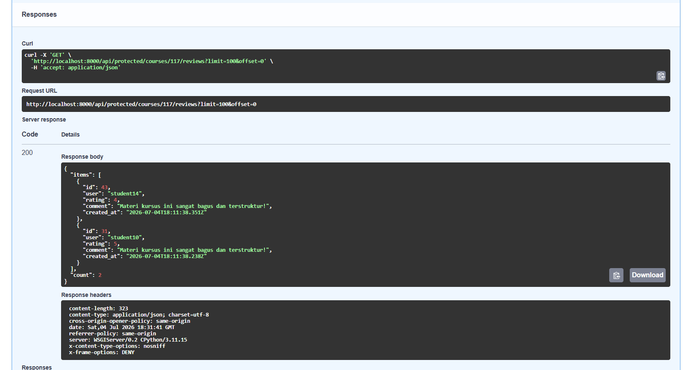
*Hasil eksekusi endpoint pengiriman atau pembacaan ulasan (Review) pada sebuah kursus tertentu.*
- 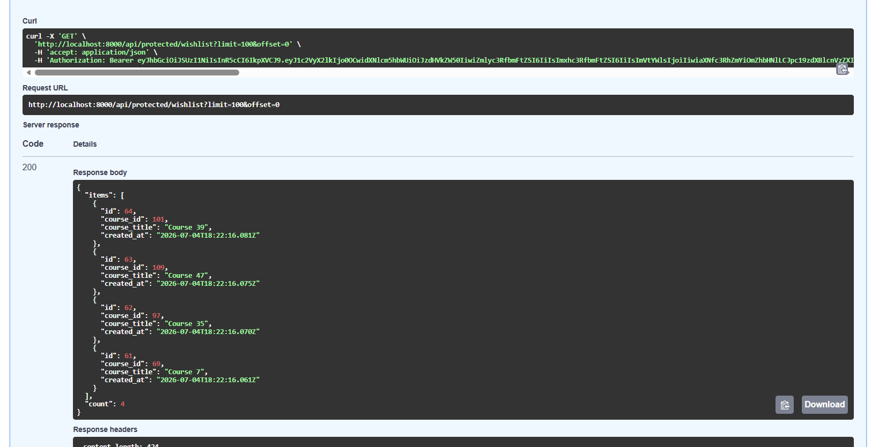
*Hasil eksekusi endpoint `GET /wishlist` yang memunculkan daftar kursus favorit milik seorang siswa.*

#### 4. Curriculum dan progress belajar detail
**Deskripsi Implementasi:**
*Course punya section/module dan progress dihitung lebih akurat.* Struktur hierarki kursus yang tadinya berderet lurus, kini dipecah bertingkat menjadi `Course -> Section -> Lesson`. Untuk penghitungan persentase ketuntasan (0.0% hingga 100.0%), kami tidak menggunakan kalkulasi kasual, melainkan algoritma matematis komputasi murni dari titik pusat *backend*.

**Bukti Pengujian:**
- 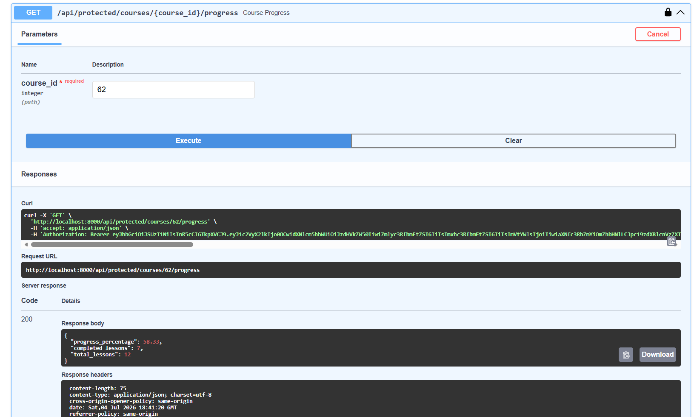
*Bukti respon berjenjang JSON (Nested Schema) pada saat pemanggilan Detail Course, yang memperlihatkan susunan Section dan Lesson anak-anaknya secara elegan.*

#### 5. Student dashboard
**Deskripsi Implementasi:**
*Ringkasan course aktif, progress, dan rekomendasi.* Endpoint `/dashboard/student` diciptakan secara eksklusif untuk merekapitulasi seluruh perjalanan belajar siswa secara *real-time*. Logika *backend* melakukan sapuan kueri untuk mengelompokkan kursus menjadi: *Active* (Sedang dipelajari), *Completed* (Tamat 100%), dan merekomendasikan kursus-kursus (*Recommended*) berdasar kategori yang sedang ia tekuni.

**Bukti Pengujian:**
- 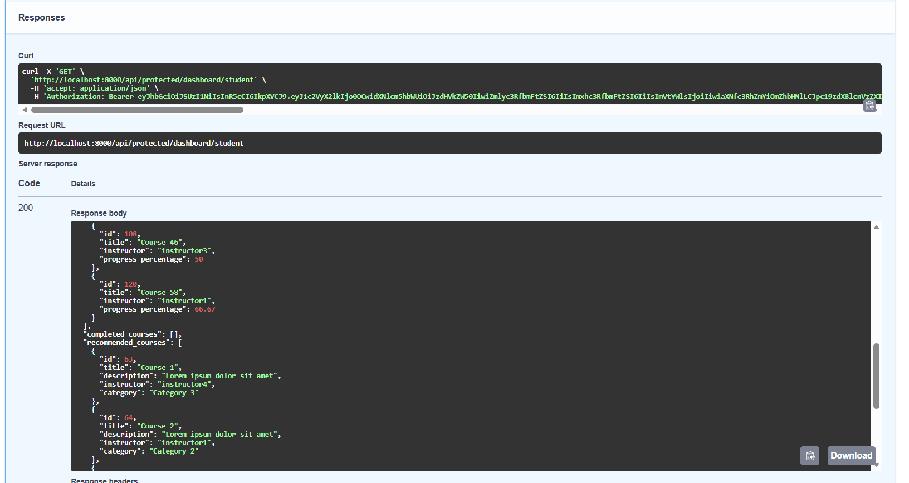
*Data JSON hasil `GET /dashboard/student` yang merangkum keseluruhan informasi holistik milik seorang siswa di satu layar.*

## 6. Cara Menjalankan Project (Docker)
Langkah-langkah mereplikasi ekosistem proyek ini:
1. Bentuk file rahasia dari cetakannya: `cp .env.example .env`
2. Bangun dan luncurkan susunan kontainer: `docker-compose up -d --build`
3. Kirimkan skema tabel terbaru: `docker-compose exec web python manage.py migrate`
4. Tabur bibit data percontohan (*seeding*): `docker-compose exec web python manage.py seed`

## 7. Akun Demo Pengujian
Skrip *seeding* menyediakan konfigurasi identitas praktis:
| Peran | Username | Password |
| :--- | :--- | :--- |
| **Administrator** | `admin` | `password123` |
| **Instructor** | `instructor` | `123` |
| **Student** | `student` | `123` |

## 8. Daftar Lengkap API Endpoint
Seluruh antarmuka ini wajib disematkan *Bearer Token* di bagian Auth (kecuali jalur *Public* tertentu). Daftar ini mencakup keseluruhan API yang terbangun di ekosistem LMS ini:

### A. Authentication & General
| Endpoint | Method | Role | Keterangan |
| :--- | :---: | :---: | :--- |
| `/api/v1/auth/sign-in` | `POST` | Public | Login dan dapatkan Access/Refresh Token (JWT). |
| `/api/v1/auth/token-refresh`| `POST` | Public | Menyegarkan masa aktif Access Token. |
| `/api/v1/protected/auth/me` | `GET` | All Auth | Mendapatkan profil kredensial user saat ini. |
| `/api/v1/protected/` | `GET` | Public | Root API untuk cek status *health*. |
| `/api/v1/protected/upload` | `POST` | All Auth | Mengunggah file (JPG, PNG, PDF) maks 2MB. |

### B. Course, Review & Comments (Public Consumption)
| Endpoint | Method | Role | Keterangan |
| :--- | :---: | :---: | :--- |
| `/api/v1/protected/courses` | `GET` | Public | Pencarian & penyaringan kursus (*search, level, status, ordering*). |
| `/api/v1/protected/courses/{id}` | `GET` | Public | Melihat detail kursus beserta *nested curriculum*. |
| `/api/v1/protected/courses/{id}/reviews`| `GET` | Public | Membaca daftar *rating* dan ulasan kursus. |
| `/api/v1/protected/courses/{id}/comments`| `GET` | Public | Membaca ruang diskusi/komentar pada kursus. |

### C. Student Experience
| Endpoint | Method | Role | Keterangan |
| :--- | :---: | :---: | :--- |
| `/api/v1/protected/dashboard/student` | `GET` | Student | Ringkasan kursus aktif, tamat, dan rekomendasi khusus siswa. |
| `/api/v1/protected/enrollments` | `POST` | Student | Mendaftar (Enroll) ke dalam sebuah kursus. |
| `/api/v1/protected/enrollments/my-courses`| `GET` | Student | Melihat daftar ringkas kursus yang telah di- *enroll*. |
| `/api/v1/protected/enrollments/{id}/progress`| `POST`| Student | Menandai *lesson* telah selesai dibaca (menyimpan log & trigger Celery). |
| `/api/v1/protected/courses/{id}/progress` | `GET` | Student | Memeriksa persentase progres belajar (kalkulasi presisi). |
| `/api/v1/protected/courses/{id}/reviews` | `POST`| Student | Mengirimkan ulasan & *rating* (harus sudah *enroll*). |
| `/api/v1/protected/courses/{id}/comments` | `POST`| Student | Menambahkan komentar di ruang diskusi. |
| `/api/v1/protected/wishlist/{course_id}` | `POST`| Student | Memasukkan (atau mengeluarkan) kursus dari daftar Wishlist. |
| `/api/v1/protected/wishlist` | `GET` | Student | Menarik daftar seluruh kursus favorit (Wishlist). |

### D. Instructor Privilege
| Endpoint | Method | Role | Keterangan |
| :--- | :---: | :---: | :--- |
| `/api/v1/protected/courses` | `POST`| Instructor | Menciptakan draf/publikasi kursus baru. |
| `/api/v1/protected/courses/{id}` | `PATCH`| Instructor | Menyunting data kursus (validasi *owner* diterapkan). |

### E. Administrator Authority
| Endpoint | Method | Role | Keterangan |
| :--- | :---: | :---: | :--- |
| `/api/v1/protected/courses/{id}` | `DELETE`| Admin | Menghapus entitas kursus secara mutlak. |
| `/api/v1/protected/comments/{id}` | `DELETE`| Admin/Owner| Menghapus komentar tidak senonoh (bisa juga oleh pembuatnya). |
| `/api/v1/protected/analytics/reports` | `GET` | Admin | Menarik statistik jumlah user, pendaftaran, dan kursus. |
| `/api/v1/protected/analytics/export` | `POST`| Admin | Memicu ekspor CSV aktivitas log (melalui Celery Worker). |

## 9. Kendala dan Solusi
Beberapa rintangan teknis yang berhasil diatasi sepanjang masa pengerjaan:
1. **Transmisi Sinyal Inotify Docker Windows Terputus:** 
   Perubahan baris kode di `api.py` dan `schemas.py` acap kali tak terekam oleh *StatReloader* karena hilangnya deteksi sinyal simpan-file (*inotify*) antara Windows dan kontainer Linux. **Solusi:** Memaksa siklus penyegaran *web container* secara manual (`docker-compose restart web`) pasca suntingan krusial.
2. **Pydantic Validation Error (Type-Safety) pada Schema:**
   Sistem melempar Error 500 karena objek PostgreSQL bertipe *datetime* dipaksa masuk ke dalam *schema* bertipe `str` murni, dan `CourseOut` tidak mengenali objek `User`/`Category`. **Solusi:** Menukar tipe pada *schema* menjadi `datetime` dari *library* bawaan, dan menginjeksi metode pelacak khusus (`resolve_instructor` / `resolve_category`).
3. **Konflik Array di Role-Based Access Control:**
   *Endpoint* menolak token *legal* (403 Forbidden) akibat metode *decorator* pelindung mencoba membandingkan string secara mentah dengan sebuah *list* (`"student" == ["student"]`). **Solusi:** Melakukan re-faktor total terhadap algoritma `role_required` agar merujuk pada logika `in list` (himpunan keanggotaan).

## 10. Kesimpulan
Menggelar konstruksi *Simple LMS Backend* merupakan pembelajaran luar biasa ihwal arsitektur *microservices*, perakitan kontainer, pengetatan gerbang keamanan (*JWT & RBAC*), serta kemewahan kecepatan *API Design* abad ke-21 menggunakan `django-ninja` disokong ketangguhan validasi *Pydantic*. Proyek ini menjelma tak hanya sekadar tugas belaka, melainkan miniatur mahakarya kesiapan industri.
